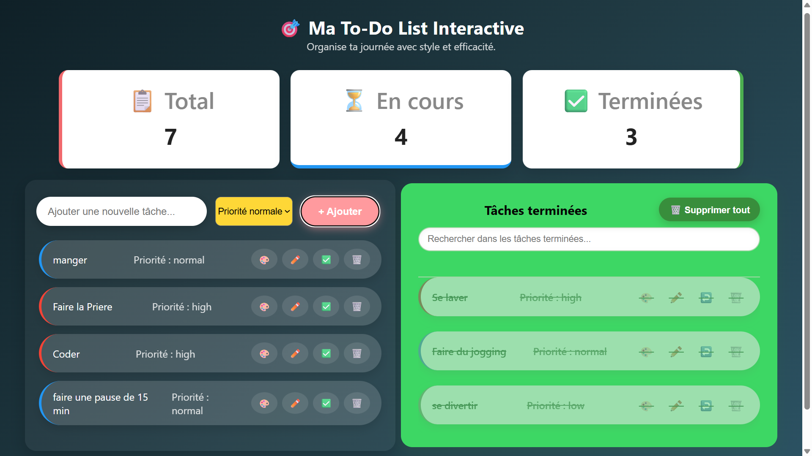

# To-Do List Interactive

Bienvenue sur le projet To-Do List Interactive, une application web moderne permettant de gérer efficacement vos tâches quotidiennes avec une interface intuitive et responsive.


## Fonctionnalités principales :

- **Ajouter / Modifier / Supprimer** des tâches
- Marquer une tâche comme **terminée / non terminée**
- **Priorité** des tâches (faible, normale, haute)
- Réorganisation par **drag & drop**
- Sauvegarde automatique dans le **localStorage**
- Interface responsive et animations fluides
- **Tests unitaires** avec QUnit sur :
  - Ajout de tâches
  - Suppression de tâches
  - Réorganisation (drag & drop)

## Structure du projet

| Fichier           | Rôle                                    |
| ----------------- | --------------------------------------- |
| `index.html`      | Structure HTML principale               |
| `style.css`       | Design et responsive                    |
| `main.js`         | Lancement de l'application              |
| `Task.js`         | Création et gestion visuelle des tâches |
| `TaskList.js`     | Gestion logique de la liste des tâches  |
| `test.js`         | Tests unitaires (QUnit)                 |
| `tests.html`      | Page dédiée pour exécuter les tests     |
| `assets/demo.png` | Image de démonstration (facultatif)     |

## Comment exécuter le projet

Cloner le dépôt :

git clone https://github.com/Boubacar1082/formation_DCLIC.git

Ouvrir le fichier index.html dans un navigateur moderne (pas besoin de serveur ni d’installation).

## Technologies utilisées

HTML5 / CSS3

JavaScript ES6 (Modules, Classes, LocalStorage)

Gestion d'événements DOM

QUnit pour les tests unitaires

## 👨‍💻 Installation et utilisation

1. **Cloner** le dépôt :

```bash
git clone https://github.com/Boubacar1082/formation_DCLIC.git
## Ouvrir simplement le fichier index.html
## Comment exécuter les tests
Ouvrir le fichier tests.html dans un navigateur.

Les tests s’exécuteront automatiquement et afficheront les résultats (ajout, suppression, drag & drop...).
```

## Licence

Projet réalisé par Boubacar Diallo
(Développé dans le cadre d’un exercice pédagogique).  
Projet libre à usage pédagogique.
